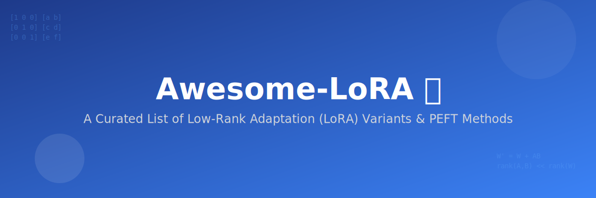

# Awesome-LoRA 🚀

  

  
  
  
  

## 🌟 Overview: Low-Rank Adaptation (LoRA) Variants in AI

**Low-Rank Adaptation (LoRA)** is the industry-standard **Parameter-Efficient Fine-Tuning (PEFT)** method. By freezing pre-trained model weights and injecting trainable rank decomposition matrices, it allows for high-performance tuning with minimal hardware requirements. 

This repository tracks the evolution of LoRA, from memory-optimized quantization techniques to dynamic rank allocation and advanced training stability methods.

---

## 🛠️ LoRA Taxonomy & Variants

### 1. 🧠 Memory and Quantization-Focused
*Optimizing LoRA for consumer GPUs and large-scale deployment.*

| Variant | Description | Year | Paper |
| :--- | :--- | :--- | :--- |
| **QLoRA** | 4-bit/8-bit quantization for massive memory savings. | 2023 | [arXiv:2305.14314](https://arxiv.org/abs/2305.14314) |
| **LQ-LoRA** | Budget-aware decomposition for targeted memory limits. | 2023 | [arXiv:2311.12023](https://arxiv.org/abs/2311.12023) |
| **LoRA-FA** | Freezes the 'A' matrix to further reduce overhead. | 2023 | [arXiv:2308.03303](https://arxiv.org/abs/2308.03303) |

  

### 2. 📊 Rank and Allocation-Focused
*Dynamically adjusting the rank for optimal parameter usage.*

| Variant | Description | Year | Paper |
| :--- | :--- | :--- | :--- |
| **AdaLoRA** | Dynamic rank allocation based on importance scores. | 2023 | [arXiv:2303.10512](https://arxiv.org/abs/2303.10512) |
| **GLoRA** | Adapters for both weights and activations. | 2023 | [arXiv:2306.07967](https://arxiv.org/abs/2306.07967) |
| **LoHa & LoKr** | Hadamard and Kronecker products for high expressivity. | 2021/22 | [LoHa](https://arxiv.org/abs/2108.06098) / [LoKr](https://arxiv.org/abs/2212.10650) |

### 3. 📈 Training Dynamics and Stability
*Improving convergence speed and fine-tuning reasoning.*

| Variant | Description | Year | Paper |
| :--- | :--- | :--- | :--- |
| **DoRA** | Weight-decomposed magnitude and direction tuning. | 2024 | [arXiv:2402.09353](https://arxiv.org/abs/2402.09353) |
| **LoRA+** | Asymmetric learning rates for faster convergence. | 2024 | [arXiv:2402.12354](https://arxiv.org/abs/2402.12354) |
| **Tied-LoRA** | Weight tying for extreme parameter efficiency. | 2023 | [arXiv:2311.09578](https://arxiv.org/abs/2311.09578) |

  

---

## 📚 References and Resources
* 📖 [arXiv Unified Study of LoRA Variants](https://arxiv.org/abs/2601.22708)
* 💡 [NVIDIA's DoRA Overview](https://developer.nvidia.com/blog/introducing-dora-a-high-performing-alternative-to-lora-for-fine-tuning/)
* 🛠️ [Hugging Face PEFT Documentation](https://huggingface.co/docs/peft/index)

---

## 📈 Star History

   <a href="https://www.star-history.com/?repos=ishandutta2007%2FAwesome-LoRA&type=date&legend=bottom-right">
    <picture>
      <source media="(prefers-color-scheme: dark)" srcset="https://api.star-history.com/chart?repos=ishandutta2007/Awesome-LoRA&type=date&theme=dark&legend=bottom-right" />
      <source media="(prefers-color-scheme: light)" srcset="https://api.star-history.com/chart?repos=ishandutta2007/Awesome-LoRA&type=date&legend=bottom-right" />
      
    </picture>
   </a>

